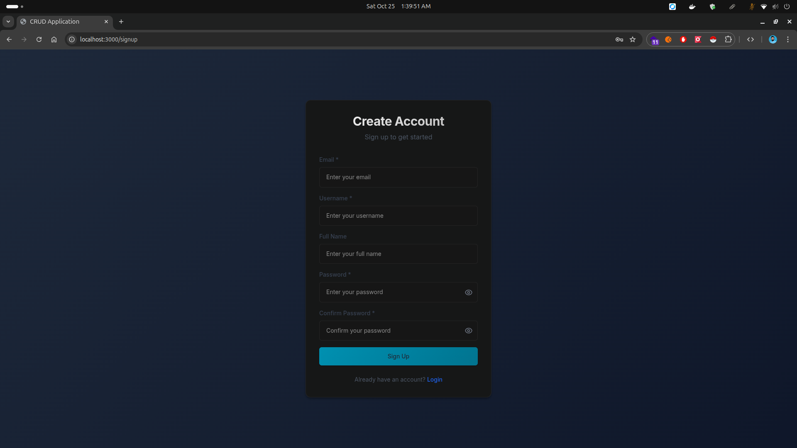

# FastAPI + React CRUD Application

A modern full-stack CRUD application built with FastAPI (Python) backend and React (TypeScript) frontend, featuring JWT authentication and modern UI design with SCSS and Tailwind CSS.

## Features

### Backend (FastAPI)
- ✅ JWT Authentication (login, signup, forgot/reset password)
- ✅ Full CRUD operations for items
- ✅ Advanced filtering, pagination, and search
- ✅ Statistics endpoint for dashboard
- ✅ PostgreSQL database with SQLAlchemy ORM
- ✅ Automatic API documentation (Swagger/OpenAPI)
- ✅ Docker containerized

### Frontend (React + TypeScript)
- ✅ Modern responsive UI with Tailwind CSS + SCSS
- ✅ Type-safe with TypeScript interfaces
- ✅ React Router for navigation
- ✅ Authentication context for state management
- ✅ Glassmorphism design with animations
- ✅ Native Fetch API for HTTP requests
- ✅ Docker containerized

## Screenshots

### Authentication

#### Login Page


#### Signup Page



#### Forgot Password


### Dashboard

#### Dashboard Overview


#### Empty Dashboard


#### User Menu


### Items Management

#### Items List - Empty State


#### Items List - With Data


#### Create New Item


#### Edit Item


#### Item Details


#### Delete Confirmation


## Quick Start

### Prerequisites
- Docker and Docker Compose
- Node.js 18+ (for local development)
- Python 3.11+ (for local development)

### Run with Docker (Recommended)

1. Clone the repository:
```bash
git clone <repository-url>
cd fastapi-reactjs-crud
```

2. Start all services:
```bash
docker-compose up --build
```

3. Seed the database with sample data:
```bash
node setup.js seed --docker
```

This will create a demo user and 15 sample items:
- **Username**: `test`
- **Password**: `test`
- **Email**: test@example.com

4. Access the application:
- **Frontend**: http://localhost:3000
- **Backend API**: http://localhost:8000
- **API Documentation**: http://localhost:8000/docs
- **Database**: localhost:5432

## Setup Commands

The project includes a convenient `setup.js` script for managing the application:

### Initial Setup
```bash
node setup.js setup              # Complete setup (database + backend + frontend)
node setup.js backend-setup      # Setup backend only (venv, dependencies)
```

### Development
```bash
node setup.js docker             # Start with Docker (recommended)
node setup.js backend            # Start backend server (local)
node setup.js frontend           # Start frontend dev server (local)
```

### Database Management
```bash
node setup.js seed               # Seed database with sample data (local)
node setup.js seed --docker      # Seed database with sample data (Docker)
node setup.js reset              # Reset database (DELETE ALL DATA)
node setup.js shell-db           # Open PostgreSQL shell
```

### Docker Commands
```bash
node setup.js docker-build       # Build and start all services
node setup.js up                 # Start Docker services
node setup.js down               # Stop Docker services
node setup.js restart            # Restart Docker services
```

### Logs & Monitoring
```bash
node setup.js logs               # View all service logs
node setup.js logs-backend       # View backend logs
node setup.js logs-frontend      # View frontend logs
node setup.js status             # Show service status
```

### Help
```bash
node setup.js help               # Show all available commands
```

## Sample Data

After seeding the database, you'll have access to:
- **1 demo user** (username: `test`, password: `test`)
- **15 sample items** across multiple categories:
  - Electronics (Laptop, Mouse, Keyboard, Webcam, etc.)
  - Accessories (USB Hub, Monitor Stand, Cable Management, etc.)
  - Furniture (Office Chair, Desk Lamp)
  - Stationery (Notebooks, Pens, Desk Organizer)

## Development Status

### ✅ Completed Core Infrastructure
- [x] Project structure setup
- [x] Docker configuration (PostgreSQL, FastAPI, React)
- [x] Backend API implementation with all endpoints
- [x] Database models and schemas
- [x] JWT authentication system
- [x] Frontend basic structure with routing
- [x] TypeScript interfaces
- [x] SCSS styling system with variables and mixins
- [x] API integration utilities
- [x] Authentication context

### 🚧 Ready for Development
The application foundation is complete! You can now:

1. **Start the services**: `docker-compose up --build`
2. **Develop frontend pages**: Complete the authentication and CRUD pages
3. **Test the API**: Visit http://localhost:8000/docs for interactive API docs
4. **Customize the UI**: Modify SCSS variables and components for your design

---

**Built with ❤️ using FastAPI and React**
